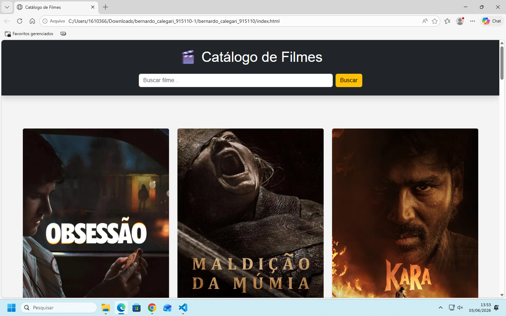
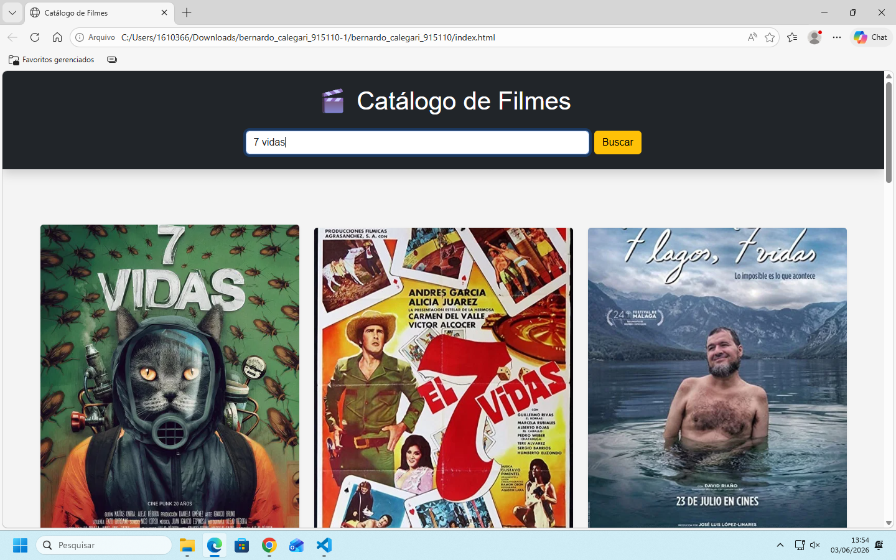

# Catálogo de Filmes com TMDB

## Nome

Bernardo Calegari de Oliveira Simeão 

## Matrícula
915110
## Descrição

Este projeto foi desenvolvido utilizando JavaScript, Fetch API e a API do TMDB para exibir um catálogo de filmes de forma dinâmica.

A aplicação realiza requisições assíncronas para buscar filmes populares e também permite pesquisar filmes pelo nome. Os dados recebidos em JSON são tratados e renderizados em cards utilizando manipulação do DOM.

## Funcionalidades

* Listagem de filmes populares
* Pesquisa de filmes por nome
* Cards dinâmicos
* Exibição de:

  * Poster
  * Título
  * Ano
  * Nota
  * Sinopse
* Tratamento de erro
* Mensagem de carregamento
* Mensagem quando não há resultados

## Endpoint utilizado

### Filmes populares

/movie/popular

### Pesquisa de filmes

/search/movie

## Tecnologias utilizadas

* HTML5
* CSS3
* JavaScript
* Bootstrap 5
* Fetch API
* TMDB API

## Prints do projeto

### Tela inicial

### Resultado da pesquisa

## Como executar

1. Abrir o projeto no VS Code
2. Instalar a extensão Live Server
3. Abrir o arquivo `index.html`
4. Executar com Live Server
